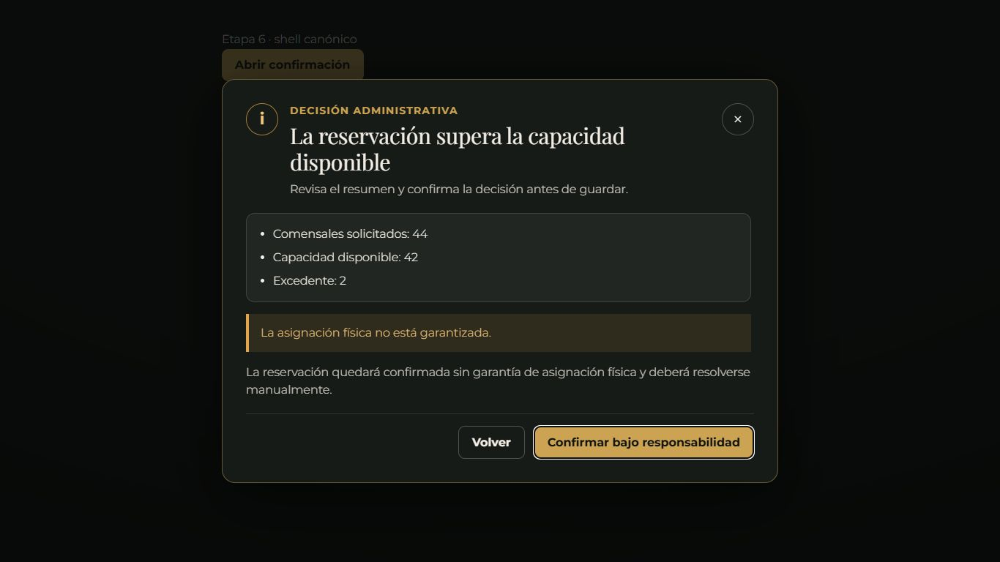
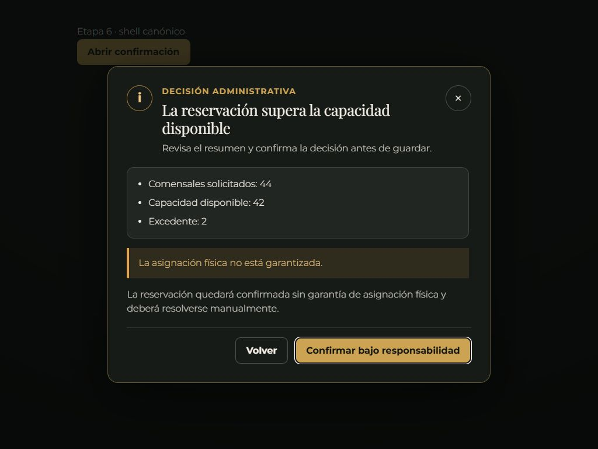
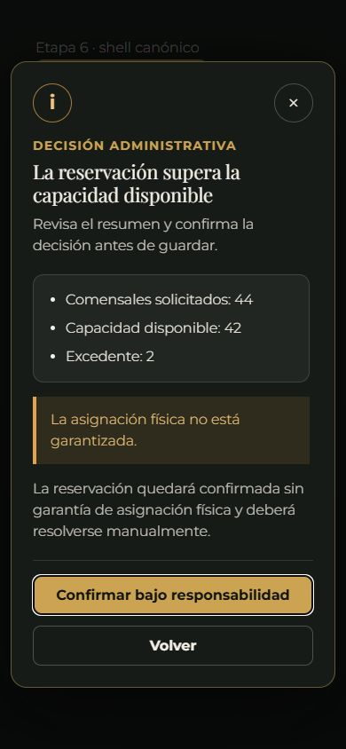

# Evidencia visual — Etapa 6

La comprobación se realizó con el navegador integrado sobre un fixture visual
local que carga los bundles generados del proyecto (`public/build/css` y
`public/build/js/bundle.min.js`). El fixture sólo abre el shell para medir su
layout; la autenticación y las decisiones de negocio se validan por separado
con el runner HTTP real y su base temporal.

## Matriz de viewports

| Viewport | Legible | Sin recorte | Botones visibles | Foco correcto | Resultado |
| ---: | :---: | :---: | :---: | :---: | --- |
| 1366 × 768 | Sí | Sí | Sí | `Confirmar bajo responsabilidad` | APROBADO |
| 1024 × 768 | Sí | Sí | Sí | Acción primaria | APROBADO |
| 390 × 844 | Sí | Sí; cuerpo preparado para scroll vertical | Sí, apilados | Acción primaria | APROBADO |

## Medidas observadas

- 1366 × 768: ancho calculado `760px`, padding `32px`, altura máxima
  `736px`.
- 1024 × 768: ancho calculado `655.36px`, padding `32px`, altura máxima
  `736px`.
- 390 × 844: ancho calculado `366px` (`100vw - 24px`), padding `24px`,
  altura máxima `820px`; botones de `316px` de ancho y al menos `44px` de
  alto.
- El título usa un mínimo de `22px`, el cuerpo `16px`, los botones `16px` y
  las acciones secundarias conservan contraste y área táctil.

## Capturas

## Accesibilidad observada

- `role="dialog"` y `aria-modal="true"` viven en el diálogo canónico.
- `aria-labelledby` apunta al título generado y `aria-describedby` a la
  descripción generada.
- El foco inicial fue la acción primaria; el shell conserva retorno al
  disparador, atrapa `Tab`, admite `Escape` y clic en backdrop cuando el caso
  es cancelable.
- Al abrir se aplica `inert` al root cerrado y se bloquea el scroll del body;
  al cerrar se restaura el foco y el scroll.
- En móvil la comparación pública apila sus columnas bajo el breakpoint de
  `639px`.

## Evidencia funcional relacionada

La evidencia autenticada reproducible está en
`scripts/tests/run-etapa6-flujos-autenticados.php` y cubre A1–A10. El resultado
actual es `PASS`.
