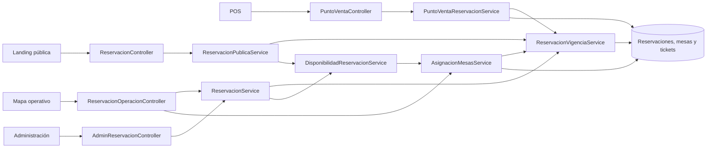
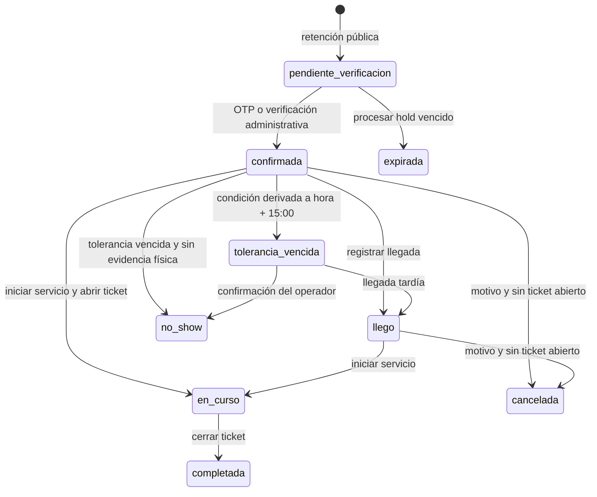

# Reporte definitivo del módulo de reservaciones

Fecha de consolidación: 30 de julio de 2026.

Este documento describe el comportamiento comprobado del módulo completo en el estado actual del repositorio. Es la referencia canónica y sustituye, para efectos funcionales y de entrega, los reportes parciales anteriores. No implica que esos archivos históricos deban eliminarse.

## 1. Resumen ejecutivo

El módulo coordina una misma reservación desde la consulta pública hasta el cierre del servicio: horarios y disponibilidad, verificación del contacto, retención temporal, creación y gestión del cliente, administración, asignación de mesas, operación en mapa y apertura/cierre de tickets en POS.

El estado actual es funcional y estable para el alcance solicitado. La vigencia se calcula en un clasificador central; la tolerancia termina exactamente a los 15 minutos; llegada, no-show, cancelación e inicio de servicio se revalidan en backend; los tickets abiertos son la fuente canónica de ocupación física; y la excepción para asignar manualmente una mesa con servicio activo exige una confirmación de dos pasos y detecta cambios concurrentes.

También existe una sección administrativa temporal, disponible únicamente con `APP_ENV=development`, para procesar retenciones vencidas y limpiar datos de prueba mediante vista previa, confirmaciones fuertes, locks, transacciones y rollback.

La suite final contiene **332 comprobaciones correctas**:

| Suite | Comprobaciones |
|---|---:|
| Etapa 1: contacto y OTP | 37 |
| Etapa 2: flujo público | 80 |
| Etapa 3: operación, capacidad, mapa y POS | 156 |
| Estabilización final | 59 |
| **Total** | **332** |

Las limitaciones reales son deliberadas: no hay cron de no-show, programador de expiración, auditoría durable, historial de reasignaciones, permisos finos por acción, notificaciones reales por correo/WhatsApp ni automatización externa. La validación manual cubrió el navegador integrado en escritorio y móvil, no una matriz de navegadores distintos.

## 2. Arquitectura

El proyecto conserva su arquitectura PHP 8 MVC y reparte las responsabilidades así:

| Capa | Responsabilidad | Componentes principales |
|---|---|---|
| Enrutamiento | Publicar páginas y contratos HTTP | `public/index.php`, `Router.php` |
| Controladores | Traducir HTTP, sesión, formato y código de respuesta | `ReservacionController`, `AdminReservacionController`, `ReservacionOperacionController`, `PuntoVentaController`, `ReservacionMantenimientoController` |
| Modelos | Persistencia y consultas de entidades | `Reservacion`, `ReservacionMesa`, `Mesa`, `Ticket`, `TicketMesa`, `VerificacionContacto` |
| Dominio | Reglas temporales, capacidad, asignación y transiciones | `ReservacionVigenciaService`, `ReservacionService`, `ReservacionPublicaService`, `DisponibilidadReservacionService`, `AsignacionMesasService`, `MesaEstadoService`, `PuntoVentaReservacionService` |
| Servicios auxiliares | Contacto, OTP, sesiones, horarios y locks | `ContactoService`, `ContactoAccesoService`, `ReservationClientSession`, `HorarioReservacionService`, `HorarioOperacionService`, `HorarioConfigLock`, `FechaOperacionLock`, `ContactoOperacionLock` |
| Presentación | Landing, administración, mapa y POS | vistas bajo `views/`, JavaScript en `src/js/`, SCSS en `src/scss/` |

`ReservacionVigenciaService` es la autoridad para las capacidades derivadas. Sus condiciones PHP y SQL comparten el mismo instante del reloj del servidor y alimentan visibilidad pública, límite por contacto, disponibilidad, ocupación lógica, administración, mapa y POS.



La landing nunca conoce IDs ni combinaciones internas de mesas. Administración puede crear con o sin asignación. El mapa presenta el detalle operativo y resuelve asignaciones. POS separa llegada de apertura de ticket y completa la reservación únicamente cuando se cierra ese ticket.

## 3. Modelo de datos

No existe una tabla separada de “retenciones”. Una retención es una fila de `reservaciones` con estado `pendiente_verificacion` y `hold_expires_at`; el desafío OTP relacionado vive en `verificaciones_contacto`.

| Tabla | Papel y campos relevantes | Claves e índices relevantes |
|---|---|---|
| `reservaciones` | Identidad, contacto normalizado, `fecha`, `hora`, `comensales`, notas, comentario interno, tokens de idempotencia, `hold_expires_at`, `confirmed_at`, `arrived_at`, `completed_at`, estado y metadatos del último cambio | PK `id`; único `request_token`; índices por fecha/estado/hora, fecha/hora, estado, contacto y retenciones vencidas; FK opcional a `usuarios` |
| `verificaciones_contacto` | Hash del OTP, expiración, intentos, consumo e invalidación; nunca almacena el código en claro | FK a reservación con `ON DELETE CASCADE`; índices por contacto, reservación y expiración |
| `reservacion_mesas` | Relación N:M histórica/operativa entre reservación y mesas, con orden | únicos `(reservacion_id, mesa_id)` y `(reservacion_id, orden)`; FKs en cascada |
| `mesas` | Número, nombre, tipo, capacidad, posición, activa y reservable | PK `id`; `numero` único |
| `tickets` | Servicio POS, apertura/cierre, estado, pago, propina, reservación y mesero opcionales | índice por estado y reservación; FK a reservación con `ON DELETE SET NULL`; único `reservacion_id`, que impide más de un ticket por reservación |
| `ticket_mesas` | Relación N:M entre servicio y mesas; fuente de ocupación física | únicos `(ticket_id, mesa_id)` y `(ticket_id, orden)`; índice por mesa; borrado en cascada por ticket |
| `horarios_operacion` | Horario semanal por día | día de semana único; FK al usuario que modificó |
| `excepciones_operacion` | Cierres y horarios especiales por fecha | fecha única e índice `(fecha, activo)` |

La restricción de `reservaciones.estado` admite:

`pendiente_verificacion`, `confirmada`, `llego`, `en_curso`, `completada`, `cancelada`, `no_show` y `expirada`.

Los campos `last_modified_by`, `last_modified_source` y `last_change_reason` explican sólo el último cambio; no sustituyen una bitácora durable.

## 4. Estados y transiciones

| Valor | Persistido | Significado | Salidas válidas |
|---|---|---|---|
| `pendiente_verificacion` | Sí | Retención pública esperando OTP | `confirmada`, `expirada` |
| `confirmada` | Sí | Contacto/registro verificado, sin servicio iniciado | `llego`, `en_curso`, `cancelada`, `no_show` sujeto a reglas |
| `tolerancia_vencida` | **No** | Condición derivada de una confirmada sin llegada ni ticket a partir de `hora + 15:00` | llegada tardía, no-show o resolución manual |
| `llego` | Sí | Llegada física registrada; `arrived_at` presente | `en_curso`, `cancelada` si no hay ticket |
| `en_curso` | Sí | Ticket abierto asociado y servicio iniciado | `completada` al cerrar el ticket |
| `completada` | Sí | Ticket asociado cerrado y servicio terminado | Final |
| `cancelada` | Sí | Cancelación explícita con motivo y sin servicio abierto | Final |
| `no_show` | Sí | Ausencia confirmada por operador después de la tolerancia | Final |
| `expirada` | Sí | Retención OTP vencida procesada | Final |



`tolerancia_vencida` nunca se escribe en la base. El registro puede continuar en `confirmada`; las capacidades calculadas representan que ya no cuenta, no bloquea y puede marcarse no-show. Si existe `arrived_at` o ticket realmente abierto, la tolerancia no lo libera: se marca como inconsistencia recuperable para que la operación alinee el estado con la evidencia.

“Confirmar verificación” y “Confirmar llegada” son acciones distintas. La primera sólo transforma una pendiente en confirmada y registra `confirmed_at`; la segunda exige una confirmada y registra `arrived_at`.

## 5. Vigencia y tolerancia

El clasificador recibe estado, fecha/hora programada, reloj del servidor, `hold_expires_at`, `arrived_at` y evidencia del ticket. Devuelve capacidades independientes, entre ellas:

`cuenta_limite`, `visible_cliente`, `influye_disponibilidad`, `visible_operacion`, `editable`, `elegible_no_show`, `tolerancia_vencida`, `puede_confirmar_llegada`, `llegada_tardia`, `ticket_abierto` e `inconsistencia_recuperable`.

| Condición | Cuenta para límite | Cliente | Disponibilidad/mesas | Operación/admin | Editable | No-show |
|---|---:|---:|---:|---:|---:|---:|
| Pendiente con hold futuro | No | No como reservación confirmada | Sí | Sí | Sí | No |
| Confirmada antes de `hora + 15` | Sí | Sí | Sí | Sí | Hasta la hora programada para datos/mesa; llegada sigue disponible durante tolerancia | No |
| Confirmada exactamente desde `hora + 15`, sin evidencia | No | No | No | Sí, rotulada “Tolerancia vencida” | No para edición ordinaria; sí para resolución de llegada/reasignación | Sí |
| Confirmada con `arrived_at` o ticket abierto | Sí | Sí | Sí | Sí, inconsistencia recuperable si el estado no coincide | Nunca si hay ticket; la llegada se recupera por flujo especializado | No |
| `llego` | Sí | Sí | Sí | Sí | Sólo dentro de la ventana ordinaria y sin ticket | No |
| `en_curso` | Sí | Sí | Sí y físicamente por ticket | Sí | No | No |
| Estado final | No | No | No, salvo que un ticket abierto inconsistente conserve ocupación física | Sí para consulta histórica | No | No |

La comparación es exclusiva en el extremo:

| Instante para una reservación de las 13:00 | Resultado |
|---|---|
| `13:14:59` | Continúa vigente |
| `13:15:00` | `tolerancia_vencida = true` |

No existe conversión automática a `no_show`. El operador debe confirmarla y el backend vuelve a comprobar estado, reloj, llegada y ticket dentro de una transacción.

## 6. Ocupación y capacidad

La condición canónica de ocupación física es:

```sql
ticket.estado = 'abierto'
AND ticket.closed_at IS NULL
```

La fecha de apertura, duración estimada, horario consultado o estado de la reservación no liberan un ticket. Una mesa deja de estar físicamente ocupada sólo cuando el ticket se cierra.

La ocupación lógica procede de:

- retención pendiente cuyo `hold_expires_at` es futuro;
- confirmada antes del límite de tolerancia;
- confirmada con llegada o ticket abierto;
- estados `llego` y `en_curso`.

Para conflictos entre reservaciones se evalúan ventanas traslapadas alrededor del horario. Para tickets no existe ventana temporal: todo ticket abierto participa siempre. Al combinar ambas fuentes, la estructura se indexa por `mesa_id`, por lo que una misma mesa asociada a reservación y ticket se cuenta una sola vez y la evidencia física tiene precedencia.

Sólo aportan capacidad las mesas:

- activas;
- reservables;
- de tipo `mesa`;
- con capacidad mayor que cero.

Quedan excluidas barras, caja, llevar, zonas especiales, mesas inactivas, no reservables o sin capacidad positiva.

La fórmula operativa es:

```text
capacidad_total =
  suma(capacidad de cada mesa reservable única)

capacidad_disponible =
  suma(capacidad de cada mesa reservable única
       cuyo mesa_id no está en ocupación lógica ∪ ocupación física)

capacidad_ocupada =
  capacidad_total - capacidad_disponible
```

La asignación pública usa únicamente combinaciones autorizadas y como máximo tres mesas. La administrativa puede escoger la combinación general mínima. Un walk-in crea sólo un ticket; nunca crea una reservación artificial. Si hay una reservación a 31–60 minutos se solicita confirmación; a 30 minutos o menos se bloquea la apertura incompatible.

## 7. Landing pública

El flujo público funciona de dos maneras:

1. Un contacto no verificado crea una retención de cinco minutos, recibe/consulta un OTP y, al validarlo, confirma atómicamente esa misma fila.
2. Una sesión pública ya verificada puede crear directamente una reservación confirmada si el contacto normalizado coincide.

Reglas principales:

- Correo: sin espacios externos, en minúsculas y validado como email.
- Teléfono mexicano: formato canónico E.164 `+52` y diez dígitos.
- OTP: seis dígitos, hash con `password_hash`, cinco minutos de vigencia, máximo cinco intentos y 60 segundos antes de reenviar.
- Sesión de cliente: identidad separada de la sesión del personal, renovable por actividad durante 15 minutos.
- Límite: máximo cinco reservaciones que actualmente tengan `cuenta_limite=true` para el contacto.
- Duplicado: mismo tipo/contacto normalizado, fecha y hora, siempre que la reservación todavía influya en disponibilidad.
- Personas: de 1 a 12 en línea.
- Asignación: automática, sólo sobre mesas reservables sin otra reservación traslapada ni ticket abierto, máximo tres mesas y combinaciones públicas autorizadas.
- Horarios: intervalos de 30 minutos derivados del horario semanal o excepción activa; no se aceptan fechas/horas pasadas ni slots fuera del horario efectivo.
- Idempotencia: `request_token` único de 16–64 caracteres y `request_fingerprint` SHA-256. Repetir el mismo token y payload devuelve el resultado existente; reutilizarlo con datos distintos devuelve conflicto.

“Mis reservaciones” sólo lista las que tengan `visible_cliente=true`; una confirmada sin evidencia desaparece exactamente al vencer su tolerancia. Modificar o cancelar exige que la reservación pertenezca a la identidad normalizada de la sesión y vuelva a ser gestionable en ese instante.

Errores funcionales esperados incluyen datos inválidos, contacto no verificado/no coincidente, sesión expirada, OTP inválido o vencido, reenvío prematuro, demasiados intentos, retención expirada, límite alcanzado, duplicado, horario inválido, falta de disponibilidad, token idempotente en conflicto, reservación inexistente o ajena al contacto.

## 8. Administración

Administración ofrece listado con filtros, alta, detalle, edición, mapa y herramientas de desarrollo.

La creación:

- admite hasta 44 comensales;
- permite contacto vacío únicamente después de una confirmación explícita en `admin-modal`;
- puede asignar automáticamente o dejar la reservación para asignación manual;
- ante capacidad insuficiente muestra comensales solicitados y capacidad disponible, y exige confirmación antes de crear sin mesas;
- usa token idempotente, locks de horario/fecha, transacción y revalidación final.

La edición vuelve a validar horario, capacidad y ocupación. Si cambian fecha, hora o comensales y la selección actual deja de ser válida, elimina únicamente la asignación operativa vigente y devuelve `requiere_asignacion` para que el operador la resuelva. No modifica reservaciones finales, históricas o con ticket abierto.

El detalle consume las capacidades del clasificador:

- verifica una pendiente cuando procede;
- registra llegada normal o tardía;
- ofrece no-show sólo con tolerancia vencida;
- cancela con motivo sólo si no hay servicio abierto;
- abre el mapa para asignar/reasignar;
- muestra el ticket y la condición operativa.

No hay botón administrativo para completar una reservación. `en_curso → completada` pertenece al cierre del ticket en POS.

Las herramientas temporales se enlazan únicamente cuando `APP_ENV=development`; el controlador también devuelve 404 fuera de ese ambiente.

## 9. Mapa operativo

El mapa usa una lectura común de mesas para administración y POS. Los estados base son:

- `disponible`;
- `ocupada`;
- `bloqueada`;
- `no_reservable`.

Los modificadores/indicadores muestran reservación próxima (`P`), bloqueo (`B`), ticket abierto (`T`), walk-in (`W`) y varias mesas. La selección actual y las mesas asignadas se presentan sin alterar el estado físico.

El operador puede seleccionar una reservación, consultar cliente, horario, comensales, mesas, nota, comentario, ticket y capacidades actuales. Según el backend puede:

- confirmar llegada o registrar llegada tardía;
- iniciar servicio;
- marcar no-show;
- cancelar con motivo;
- editar comentario interno;
- asignar o reasignar manual/automáticamente;
- consultar el ticket.

La asignación manual sobre tickets abiertos es una excepción exclusiva del mapa:

1. La primera solicitud no guarda nada.
2. El backend devuelve `CONFLICTO_TICKETS_ABIERTOS`, token de conflicto y, por ticket, ID, hora de apertura, origen, reservación opcional, mesas totales y mesas seleccionadas en conflicto.
3. El modal presenta mesa, ticket, apertura, origen y demás mesas asociadas.
4. La segunda solicitud envía los IDs exactos aceptados, el token y la versión de la reservación.
5. Dentro de una transacción se vuelven a bloquear/revisar reservación, mesas y tickets.
6. Si cerró, cambió de mesa, apareció otro ticket o cambió la asignación, responde 409 `CONFLICTO_CONCURRENTE`.

Aceptar la excepción no vincula el ticket existente con la reservación. Sólo permite conservar la selección manual; el servicio físico continúa perteneciendo a su ticket original.

Una fecha pasada entra en `solo_lectura`. Para el día actual, una hora ya vencida se resuelve al siguiente slot disponible; si no queda ninguno, las mutaciones quedan deshabilitadas. Los avisos usan una única tarjeta global flotante, colapsable y accesible. No se usan `alert()` ni `confirm()`.

En móvil el plano conserva un piso de 820 px dentro de un viewport desplazable horizontal y verticalmente; las mesas no se reescalan hasta superponerse y el documento no adquiere overflow lateral.

## 10. POS

POS combina el plano físico, reservaciones del día y tickets:

- Una llegada cambia `confirmada → llego` y registra `arrived_at`; no abre ticket.
- Una llegada tardía aplica la misma transición, pero revalida mesas originales, ocupación y capacidad. Si ya no son utilizables devuelve `REQUIERE_REASIGNACION`; si la selección no cubre comensales devuelve `SIN_CAPACIDAD`.
- Iniciar servicio desde `confirmada` o `llego` crea un ticket, relaciona todas las mesas, registra llegada si faltaba y cambia a `en_curso`.
- Una confirmada vencida puede abrir su modal directamente desde la tarjeta; la interfaz ofrece llegada tardía, inicio de servicio o reasignación según corresponda.
- No-show nunca está disponible después de llegada o con ticket abierto.
- Cancelar exige motivo y no puede competir con un servicio iniciado.
- Cerrar el ticket establece `estado='cerrado'`, `closed_at`, pago/propina, crea/reutiliza token de feedback y transforma `en_curso → completada`.
- La liberación física ocurre por el cierre real: al dejar de cumplir la condición canónica, `ticket_mesas` ya no ocupa el plano aunque las relaciones se conserven.

Los walk-ins abren tickets sin `reservacion_id`. Una reservación próxima dentro de 60 minutos genera advertencia; dentro de los 30 minutos de bloqueo no se permite un ticket incompatible. La apertura simultánea sobre la misma mesa tiene un solo ganador.

## 11. Herramientas de mantenimiento

La página `/admin/reservations/development-tools` tiene doble protección:

- la navegación sólo se renderiza con `APP_ENV=development`;
- el controlador responde 404 para cualquier otro ambiente, incluso si se invoca la URL directamente.

El servicio admite `testing` únicamente para las suites automatizadas; la superficie HTTP exige exactamente `development`.

### Procesar pendientes vencidas

La vista previa cuenta filas `pendiente_verificacion` con `hold_expires_at <= ahora`. Tras confirmación explícita, una transacción bloquea los IDs ordenados, revalida el corte y cambia únicamente esas filas a `expirada`. Las pendientes con hold futuro se conservan.

### Limpiar reservaciones de prueba

La vista previa recibe rango inclusivo, estados `no_show`, `expirada` o `pendiente_verificacion`, y prefijo opcional sobre nombre/contacto. Informa procesables, omitidas, relaciones de mesas/verificaciones y motivos de omisión.

La ejecución exige escribir `LIMPIAR RESERVACIONES`. Incluir pendientes todavía vigentes requiere activar una opción separada y escribir además `LIMPIAR PENDIENTES VIGENTES`.

Siempre se omiten filas con ticket abierto, cualquier ticket histórico, `arrived_at`, `completed_at` u otra evidencia operativa. La consulta se limita estrictamente al rango y estados seleccionados. Dentro de una transacción se bloquean las reservaciones, se revalidan, se eliminan primero verificaciones y relaciones de mesas y al final las reservaciones. Cualquier error produce rollback completo.

Estas acciones reproducen temporalmente el trabajo que podría ejecutar una automatización futura. No son funcionalidad productiva.

## 12. Concurrencia y seguridad lógica

Las mutaciones sensibles usan transacciones y lectura `FOR UPDATE`. El orden general es:

1. reservación;
2. mesas ordenadas por ID;
3. tickets ordenados por ID.

Los flujos públicos agregan locks nominales estables para configuración de horarios, contacto normalizado y fechas ordenadas. Así el límite de cinco, la detección de duplicados y la selección de mesas se ejecutan contra el mismo estado.

La asignación manual incorpora dos comprobaciones optimistas:

- `version_esperada`: hash del timestamp de la reservación y sus mesas actuales;
- `conflicto_token`: hash del conjunto exacto de tickets/mesas que vio el operador.

Dos operadores que intentan reasignar desde la misma versión no pueden sobrescribirse silenciosamente: uno gana y el otro recibe 409.

La apertura e inicio de servicio bloquean las mesas en orden ascendente antes de insertar `ticket_mesas`. El índice único por reservación y la comprobación canónica de tickets evitan duplicar el servicio. Inicio y cierre repetidos son idempotentes cuando ya existe el resultado correcto.

Los contratos distinguen:

- **409 `CONFLICTO_CONCURRENTE`**: la ocupación, asignación o conjunto de tickets cambió desde que se abrió el modal;
- **422 validación funcional**: datos inválidos o acción no permitida por estado/capacidad/tolerancia;
- 401/403 para autenticación/propiedad, 404 para inexistencia, 410 para retención expirada, 429 para límites de OTP y 500 para error interno.

El cierre parte del ticket, lo bloquea y luego bloquea la reservación relacionada; no necesita reasignar mesas. La ocupación deja de existir por el cambio atómico del ticket a cerrado.

## 13. Endpoints y contratos HTTP

En la tabla, “público” significa sin sesión de personal; algunas operaciones exigen la sesión temporal de contacto. Las rutas `/admin/*` requieren rol administrador. POS y sus APIs requieren sesión de personal.

| Ruta | Método | Autenticación / transporte | Parámetros principales | Éxito | Errores esperados | Servicio |
|---|---|---|---|---|---|---|
| `/reservaciones` | GET | Público, HTML | — | Landing | 500 de render | `HomeController` |
| `/api/reservation-schedules` | GET | Público, JSON | `fecha` | 200, slots/horario | 405, 422, 500 | `ReservacionService` |
| `/api/reservaciones/disponibilidad` | GET | Público, JSON | `fecha`, `personas` | 200, slots sin IDs de mesa | 405, 422, 500 | `DisponibilidadReservacionService` |
| `/api/operacion/horario-efectivo` | GET | Público, JSON | `fecha` | 200, horario semanal/excepción | 422, 500 | `HorarioOperacionService` |
| `/api/reservaciones/retencion` | POST | Público, form o JSON | nombre, contacto, fecha, hora, personas, notas, `request_token` | 201, hold y OTP | 409, 422, 429, 500 | `ReservacionPublicaService` |
| `/api/reservaciones/crear` | POST | Sesión de contacto o fallback a retención, form/JSON | payload de reservación | 201, confirmada/retención | 401, 409, 422, 500 | `ReservacionPublicaService` |
| `/api/reservaciones/contacto/codigo` | POST | Público, form/JSON | tipo, contacto; `request_token` al reenviar retención | 201 | 422, 429, 500 | `ContactoAccesoService` / `ReservacionPublicaService` |
| `/api/reservaciones/contacto/verificar` | POST | Público, form/JSON | tipo, contacto, código; token opcional | 200, sesión o retención confirmada | 410, 422, 429, 500 | `ContactoAccesoService` / `ReservacionPublicaService` |
| `/api/reservaciones/mis-reservaciones` | GET | Sesión de contacto, JSON | — | 200, visibles y capacidades de gestión | 401, 405, 500 | `Reservacion`, clasificador central |
| `/api/reservaciones/modificar` | POST | Sesión de contacto, form/JSON | ID y datos editables | 200 | 401, 403, 404, 409, 422, 500 | `ReservacionPublicaService` |
| `/api/reservaciones/cancelar` | POST | Sesión de contacto, form/JSON | `reservacion_id` | 200 | 401, 403, 404, 422, 500 | `ReservacionPublicaService` |
| `/api/reservaciones/contacto/logout` | POST | Sesión de contacto, form/JSON | `csrf_token` | 200 | 403, 405 | `ReservationClientSession` |
| `/admin/reservations` | GET | Admin, HTML | filtros | 200, listado | 302/403 | `AdminReservacionController` |
| `/admin/reservations/create` | GET/POST | Admin, HTML/form | datos, confirmaciones, asignación | 200/302 | validación en modal/redirect | `ReservacionService` |
| `/admin/reservations/show` | GET | Admin, HTML | `id`, `back` | 200, detalle/capacidades | 302/404 | `AdminReservacionController` |
| `/admin/reservations/update` | POST | Admin, form | ID y datos | 302 | 409 funcional vía resultado, validación | `ReservacionService` |
| `/admin/reservations/status` | POST | Admin, form o JSON según cabecera | ID, acción/estado, motivo, mesero | 200/302 | 404, 409, 422, 500 | `ReservacionService`, `PuntoVentaReservacionService` |
| `/admin/reservations/reassign` | POST | Admin, form/JSON | ID | 200/302 | 404, 409, 422, 500 | `AsignacionMesasService` |
| `/admin/reservations/operation` | GET | Admin, HTML | fecha, hora, estado, reservación | 200 | 302 | `ReservacionOperacionController` |
| `/admin/api/reservations/operation` | GET | Admin, JSON | fecha, hora | 200, reservaciones/mesas/ocupación/config | 401/403, 422, 500 | `ReservacionOperacionController`, `MesaEstadoService` |
| `/admin/api/reservations/operation/assign-tables` | POST | Admin, form | ID, `mesa_ids`, capacidad, tickets aceptados, tokens y versión | 200 | 404, 409, 422, 500 | `AsignacionMesasService` |
| `/admin/api/reservations/operation/reassign` | POST | Admin, form | ID | 200 | 404, 409, 422, 500 | `AsignacionMesasService` |
| `/admin/api/reservations/operation/update-comment` | POST | Admin, form | ID, comentario | 200 | 404, 409, 422, 500 | `ReservacionService` |
| `/admin/api/reservations/operation/status` | POST | Admin, form | ID, estado/acción, motivo, mesero | 200 | 404, 409, 422, 500 | `ReservacionService`, `PuntoVentaReservacionService` |
| `/admin/reservations/development-tools` | GET | Admin + `APP_ENV=development`, HTML | — | 200, vistas previas | 404 fuera de development | `ReservacionMantenimientoService` |
| `/admin/reservations/development-tools/process-expired` | POST | Admin + development, form | `confirmar=1` | 200, resumen | 404, 405, confirmación inválida, 500 | `ReservacionMantenimientoService` |
| `/admin/reservations/development-tools/cleanup-preview` | POST | Admin + development, form | rango, estados, prefijo, opción pendientes | 200, resumen | 404, 405, 422 lógico, 500 | `ReservacionMantenimientoService` |
| `/admin/reservations/development-tools/cleanup` | POST | Admin + development, form | filtros y confirmaciones fuertes | 200, procesadas/omitidas/fallidas | 404, 405, confirmación inválida, 500 | `ReservacionMantenimientoService` |
| `/punto-de-venta` | GET | Personal, HTML | — | 200, POS | 302 a login | `PuntoVentaController` |
| `/api/punto-de-venta` | GET | Personal, JSON | contexto del plano | 200 | 401, 500 | `MesaEstadoService` y modelos POS |
| `/api/punto-de-venta/reservaciones` | GET | Personal, JSON | `fecha` | 200, lista y capacidades | 401, 422 | `PuntoVentaReservacionService` |
| `/api/punto-de-venta/mesa-contexto` | GET | Personal, JSON | `mesa_id` | 200, ticket/reserva próxima | 401, 422 | `PuntoVentaReservacionService` |
| `/api/punto-de-venta/reservaciones/llegada` | POST | Personal, JSON | `reservacion_id` | 200, `llego` | 409/422 | `PuntoVentaReservacionService` |
| `/api/punto-de-venta/reservaciones/comenzar` | POST | Personal, JSON | reservación, mesero opcional | 200, ticket e `en_curso` | 409/422/500 | `PuntoVentaReservacionService` |
| `/api/punto-de-venta/reservaciones/cancelar` | POST | Personal, JSON | reservación, motivo | 200 | 409/422 | `PuntoVentaReservacionService` |
| `/api/punto-de-venta/reservaciones/no-show` | POST | Personal, JSON | reservación, motivo | 200 | 409/422 | `PuntoVentaReservacionService` |
| `/api/abrir-ticket` | POST | Personal, JSON | reservación o mesas/comensales walk-in | 200, ticket | 409/422/500 | `PuntoVentaReservacionService` |
| `/api/liberar-reservacion` | POST | Personal, JSON | reservación, motivo | 200, cancelada | 409/422 | `PuntoVentaReservacionService` |
| `/api/cerrar-ticket` | POST | Personal, JSON | ticket, pago, propina, pagos divididos | 200, ticket cerrado/token | 409/422/500 | `PuntoVentaReservacionService` |

## 14. Archivos principales

### Backend

- `controllers/ReservacionController.php`
- `controllers/AdminReservacionController.php`
- `controllers/ReservacionOperacionController.php`
- `controllers/PuntoVentaController.php`
- `controllers/ReservacionMantenimientoController.php`
- `models/Reservacion.php`
- `models/ReservacionMesa.php`
- `models/Mesa.php`
- `models/TicketMesa.php`
- `models/VerificacionContacto.php`
- `services/ReservacionVigenciaService.php`
- `services/ReservacionConfig.php`
- `services/ReservacionService.php`
- `services/ReservacionPublicaService.php`
- `services/DisponibilidadReservacionService.php`
- `services/AsignacionMesasService.php`
- `services/MesaEstadoService.php`
- `services/PuntoVentaReservacionService.php`
- `services/ReservacionMantenimientoService.php`
- `services/ContactoService.php`
- `services/ContactoAccesoService.php`
- `services/HorarioReservacionService.php`
- `public/index.php`

### Interfaz y estilos

- `views/admin/reservations/index.php`
- `views/admin/reservations/show.php`
- `views/admin/reservations/development-tools.php`
- `views/operation/reservations/index.php`
- `views/punto-de-venta/index.php`
- `src/js/admin/reservations/form.js`
- `src/js/admin/reservations/operation.js`
- `src/js/modules/reservation-access.js`
- `src/js/modules/punto-de-venta.js`
- `src/scss/admin/modules/reservations.scss`
- `src/scss/components/_reserva.scss`
- `src/scss/operation/_create-modal.scss`
- `src/scss/operation/_map-shell.scss`

### Pruebas, scripts y documentación

- `tests/ReservacionContactoEtapa1Test.php`
- `tests/ReservacionPublicaEtapa2Test.php`
- `tests/ReservacionEtapa3Test.php`
- `tests/ReservacionEtapa3ConcurrencyWorker.php`
- `tests/ReservacionEstabilizacionTest.php`
- `scripts/run-tests.php`
- `scripts/expire_reservation_holds.php`
- `database/ddl.sql`
- `docs/reservaciones/reporte-definitivo-modulo-reservaciones.md`

### Lista exacta intervenida en esta etapa de estabilización

Archivos fuente/backend:

- `controllers/AdminReservacionController.php`
- `controllers/PuntoVentaController.php`
- `controllers/ReservacionOperacionController.php`
- `controllers/ReservacionMantenimientoController.php` (nuevo)
- `models/Reservacion.php`
- `models/ReservacionMesa.php`
- `public/index.php`
- `services/AsignacionMesasService.php`
- `services/MesaEstadoService.php` (nuevo en el conjunto de trabajo)
- `services/PuntoVentaReservacionService.php`
- `services/ReservacionConfig.php`
- `services/ReservacionPublicaService.php`
- `services/ReservacionService.php`
- `services/ReservacionMantenimientoService.php` (nuevo)
- `services/ReservacionVigenciaService.php` (nuevo)

Archivos de interfaz:

- `views/admin/reservations/index.php`
- `views/admin/reservations/show.php`
- `views/admin/reservations/development-tools.php` (nuevo)
- `views/operation/reservations/index.php`
- `src/js/admin/reservations/form.js`
- `src/js/admin/reservations/operation.js`
- `src/js/modules/punto-de-venta.js`
- `src/js/modules/reservation-access.js`
- `src/scss/admin/modules/reservations.scss`
- `src/scss/components/_reserva.scss`
- `src/scss/operation/_create-modal.scss`
- `src/scss/operation/_map-shell.scss`

Pruebas y documentación:

- `tests/ReservacionEtapa3Test.php`
- `tests/ReservacionEtapa3ConcurrencyWorker.php`
- `tests/ReservacionEstabilizacionTest.php` (nuevo)
- `scripts/run-tests.php`
- `docs/reservaciones/reporte-definitivo-modulo-reservaciones.md` (nuevo)

Artefactos recompilados que contienen estos cambios:

- `assets/css/app.css`
- `assets/css/app.css.map`
- `assets/js/bundle.min.js`
- `assets/js/bundle.js.min.map`
- `public/build/css/app.css`
- `public/build/css/app.css.map`
- `public/build/css/admin/reservations.css`
- `public/build/css/operation/reservations.css`
- `public/build/js/bundle.min.js`
- `public/build/js/bundle.js.min.map`
- `public/build/js/admin/map.js`
- `public/build/js/admin/map.js.map`
- `public/build/js/admin/reservation-form.js`
- `public/build/js/admin/reservation-form.js.map`
- `public/build/js/admin/reservation-operation.js`
- `public/build/js/admin/reservation-operation.js.map`

El repositorio ya contenía cambios locales ajenos o anteriores a esta etapa. Se preservaron y no se atribuyen aquí como implementación nueva.

## 15. Pruebas

La suite se ejecutó con `npm.cmd test`, que llama `php scripts/run-tests.php`. Resultado final:

```text
OK: 37 comprobaciones de Etapa 1.
OK: 80 comprobaciones de Etapa 2.
OK: 156 comprobaciones de Etapa 3.
OK: 59 comprobaciones de estabilización.
```

Las suites son pruebas de servicio/integración sobre MySQL real. Cada una crea desde cero una base desechable con `database/ddl.sql`, fija la zona `-06:00` y el reloj de PHP/MySQL, ejecuta los casos y elimina la base al finalizar:

- `casa_pestalozzi_etapa1_test`;
- `casa_pestalozzi_etapa2_test`;
- `casa_pestalozzi_etapa3_test`;
- `casa_pestalozzi_estabilizacion_test`.

Los casos de estabilización se concentran alrededor del 30 de noviembre de 2026 y cubren:

- `+14:59` vigente y `+15:00` vencida;
- límite público, visibilidad, disponibilidad y liberación lógica;
- evidencia `arrived_at` y ticket abierto;
- llegada normal, exacta al límite y tardía;
- llegada con mesas ocupadas o capacidad insuficiente;
- no-show válido, rechazado tras llegada y rechazado con ticket;
- carrera llegada/no-show e inicio/no-show;
- inicio directo desde confirmada y persistencia de `arrived_at`;
- asignación automática/pública bloqueada por ticket;
- conflicto manual y confirmación válida;
- ticket cerrado, movido o nuevo entre vista previa y confirmación;
- dos operadores reasignando desde la misma versión;
- procesamiento de pendiente vencida sin tocar pendiente vigente;
- limpieza por estado/rango/prefijo, omisión por evidencia, confirmación fuerte y rollback forzado;
- servicio de mantenimiento rechazado en producción.

Validación técnica ejecutada:

| Evidencia | Resultado |
|---|---|
| `php -l` en los PHP de la etapa | Correcto |
| `node --check` en formulario, mapa, acceso público y POS | Correcto |
| `git diff --check` | Correcto; sólo avisos LF/CRLF |
| `npm.cmd run build` | Correcto; CSS y bundles completos |
| Sass | Correcto; avisos de deprecación de la API legacy, sin error |
| HTTP autenticado | 200 en administración, mapa, herramientas y POS |
| JSON autenticado | `ok=true`; 11 reservaciones y 16 mesas en el juego local inspeccionado |
| Navegador escritorio 1440×900 | Mapa, detalle, modales, herramientas y POS correctos |
| Navegador móvil 390×844 | Mapa desplazable, detalle, modales y POS sin overflow del documento |
| Consola del navegador | Sin warnings ni errores |

La prueba HTTP/manual fue no destructiva: se autenticó con las credenciales de demostración del repositorio y sólo se realizaron GET y apertura/cierre visual de modales. No se confirmó ninguna mutación sobre reservaciones reales.

## 16. Limitaciones y trabajo futuro

Pendientes reales, fuera del alcance implementado:

1. Programar la expiración de retenciones. Existe lógica manual y un punto de servicio/script, pero no hay cron ni scheduler productivo conectado.
2. Automatizar no-shows si el negocio decide hacerlo. Actualmente siempre requieren decisión del operador.
3. Incorporar auditoría durable de todas las transiciones y aceptaciones manuales. Hoy sólo queda el último usuario/origen/motivo.
4. Mantener historial de reasignaciones y de excepciones sobre tickets abiertos. La relación actual no conserva versiones sucesivas.
5. Definir permisos finos por rol/acción. Sólo existe la separación general ya presente entre administrador y personal autenticado.
6. Conectar un proveedor real de email o WhatsApp. El entorno actual usa proveedor/preview de desarrollo; no se añadió n8n.
7. Añadir una suite E2E automatizada y una matriz Chrome/Edge/Firefox/Safari. La evidencia visual actual corresponde al navegador integrado.
8. Retirar las herramientas destructivas de desarrollo cuando la automatización y la estrategia formal de datos de prueba las sustituyan.
9. La excepción manual puede dejar una reservación lógicamente asignada a una mesa físicamente ocupada, de forma intencional y visible. Resolver el servicio/ticket sigue siendo responsabilidad del operador; no se relinkea silenciosamente.

No se implementaron tabla de auditoría, cron, n8n, mensajes reales, permisos adicionales, CAPTCHA ni complejidad externa al alcance.

## 17. Estado final

| Funcionalidad | Estado | Pruebas | Validación visual | Pendientes |
|---|---|---|---|---|
| Contacto, OTP y sesión pública | Implementada | Etapas 1–3 | Landing/componentes compilados; flujo cubierto por servicio | Proveedor real de notificaciones |
| Retención, idempotencia y límite | Implementada | Etapas 2–4 | Contratos HTTP verificados | Scheduler de expiración |
| Vigencia y tolerancia exacta | Implementada y centralizada | Casos `+14:59/+15:00` y evidencia física | Etiqueta “Tolerancia vencida” comprobada | Automatización opcional de no-show |
| Disponibilidad y capacidad | Implementada | Ocupación lógica/física, deduplicación, cupo cero | Mapas admin/POS comprobados | Ninguno dentro del alcance |
| Llegada, llegada tardía y no-show | Implementada | Casos normales, límite y carreras | Acciones y modal comprobados | Automatización opcional |
| Inicio/cierre de servicio | Implementada | Apertura/cierre, idempotencia y concurrencia | Modal POS desktop/móvil comprobado | Ninguno dentro del alcance |
| Asignación manual con ticket abierto | Implementada con doble confirmación | Cierre, movimiento, nuevo ticket y dos operadores | Modal de conflicto disponible en mapa | Auditoría/historial durable |
| Mapa operativo | Implementado | Contratos y serialización cubiertos | Desktop/móvil, sin errores de consola | Suite E2E multi-browser |
| Detalle administrativo | Implementado | Capacidades/transiciones cubiertas | Desktop/móvil y modal de cancelación | Permisos finos por acción |
| Herramientas de desarrollo | Implementadas y protegidas | Preview, proceso, limpieza, omisión, rollback, producción | Desktop/móvil y modales comprobados | Sustituir por automatización formal |
| Compilación y calidad estática | Correcta | 332 comprobaciones | Bundles finales cargados | Actualizar dependencias para retirar warnings legacy |

La implementación, pruebas, compilación, validación HTTP y revisión visual solicitadas están completas. No se creó migración y **no se realizó commit**.
