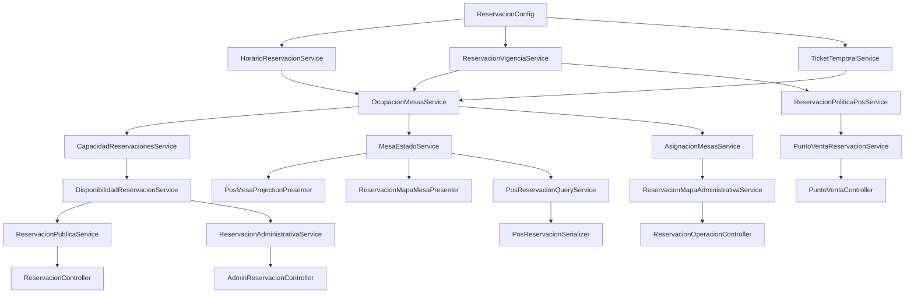

# Mantenimiento técnico del módulo de reservaciones

## 1. Propósito

Esta guía explica cómo está implementado el módulo y cómo modificarlo sin
romper sus contratos. Describe la arquitectura vigente; no sustituye las
reglas funcionales de [`docs/reservaciones.md`](reservaciones.md) ni convierte
las auditorías históricas en normativa.

La regla de trabajo es: primero localizar la decisión de dominio y su prueba,
después tocar el consumidor. No se deben reconstruir reglas temporales,
capacidad o traslapes en una vista o en JavaScript.

## 2. Fuente de verdad

La única fuente funcional es [`docs/reservaciones.md`](reservaciones.md).

Si el código y la fuente funcional divergen, el comportamiento no debe
“documentarse como está” sin antes clasificar el hallazgo y decidir si
corresponde una corrección o un cierre con riesgo residual.

## 3. Arquitectura general

Las solicitudes entran por `public/index.php`. La protección de rutas ocurre
antes del despacho en `Classes\Auth::proteger()`. Los controladores traducen
HTTP y los servicios resuelven las reglas de negocio. Los modelos y
`ActiveRecord` leen o escriben MySQL.

El núcleo operativo se puede seguir así:



La cadena no implica que cada servicio llame siempre a todos los demás. Es un
mapa de autoridad: horarios, vigencia, tickets, ocupación, capacidad,
asignación y presentación tienen responsabilidades distintas.

## 4. Flujo de datos

1. `ReservacionConfig` proporciona reloj, zona horaria y parámetros.
2. `HorarioReservacionService` resuelve horario semanal, excepciones, cierre,
   anticipación, horizonte y slots.
3. `ReservacionVigenciaService` clasifica retención, ventana operativa,
   tolerancia y ausencia pendiente.
4. `TicketTemporalService` distingue ticket abierto actual de liberación
   estimada futura.
5. `OcupacionMesasService` compone reservaciones, holds y tickets sobre el
   intervalo `[inicio, fin)`.
6. `CapacidadReservacionesService` calcula capacidad física, demanda no
   asignada y capacidad real.
7. `MesaEstadoService` construye los hechos por mesa y llama a cada presenter.
8. `PosReservacionQueryService` serializa la lectura para POS y mapa; los
   controladores sólo filtran o agregan datos de superficie.
9. JavaScript usa los hechos, presentaciones y acciones recibidos. No decide
   ventanas temporales ni capacidad.

## 5. Configuración canónica

La autoridad es `services/ReservacionConfig.php`. Los valores funcionales
vigentes son:

| Constante | Valor vigente | Uso |
| --- | ---: | --- |
| `DURACION_RESERVACION_MINUTOS` | 90 | Duración del intervalo planificado |
| `DURACION_ESTIMADA_TICKET_MINUTOS` | 90 | Liberación proyectada de ticket |
| `RETRASO_ESTIMADO_TICKET_MINUTOS` | 0 | Margen adicional de proyección |
| `ANTICIPACION_MINIMA_MINUTOS` | 40 | Primer instante reservable |
| `MINUTOS_ANTES_CIERRE_ULTIMA_RESERVACION` | 90 | Límite respecto al cierre |
| `VIGENCIA_HOLD_MINUTOS` | 15 | Retención de landing |
| `TOLERANCIA_LLEGADA_MINUTOS` | 15 | Espera después del inicio |
| `AVISO_RESERVACION_PROXIMA_MINUTOS` | 60 | Inicio de advertencia |
| `BLOQUEO_WALKIN_ANTES_RESERVACION_MINUTOS` | 30 | Inicio del bloqueo POS |
| `INICIO_SERVICIO_ANTICIPADO_MINUTOS` | 30 | Permiso para iniciar servicio |
| `LIMITE_MODIFICACION_MINUTOS` | 30 | Límite de modificación pública |
| `TOLERANCIA_CANCELACION_PUBLICA_MINUTOS` | 15 | Límite de cancelación pública |
| `MAX_RESERVACIONES_ACTIVAS_POR_CONTACTO` | 5 | Límite público por contacto |
| `HORIZONTE_MAXIMO_DIAS` | 90 | Horizonte de fechas |
| `INTERVALO_RESERVACION_MINUTOS` | 30 | Granularidad de slots |

También existen parámetros auxiliares como `BLOQUEO_PREVIO_MESA_MINUTOS`,
`MARGEN_PREPARACION_MESA_MINUTOS`, `MARGEN_MINIMO_SEGURIDAD_MINUTOS`,
`REFRESCO_ESTADOS_SEGUNDOS`, límites OTP y máximos de comensales. No se deben
crear aliases funcionales para ellos.

`configuracionOperacion()` es la salida canónica para exponer configuración
operativa al backend consumidor. JavaScript puede mostrar o contar el tiempo
del lado de presentación, pero no debe volver a calcular reglas de negocio.
El reloj productivo es `ReservacionConfig::ahora()` en
`America/Mexico_City`; `RESERVATION_TEST_NOW` sólo se acepta en `APP_ENV`
testing.

## 6. Motor temporal

`HorarioReservacionService` usa `horarios_operacion` y
`excepciones_operacion` para obtener el horario efectivo. Distingue fecha
inválida, fecha pasada, horizonte superado, día cerrado, horario no
configurado, anticipación insuficiente y última reservación.

`ReservacionVigenciaService` usa el reloj real (`ahora`) para clasificar:

- `futura`;
- `advertencia`;
- `bloqueo`;
- `inicio`;
- `tolerancia`;
- `ausencia_pendiente`;
- `en_curso`.

`hora_consulta` es la hora solicitada para una proyección de mapa o
disponibilidad. Nunca debe sustituirse por `ahora` sin una decisión explícita:

```text
hora_consulta ≠ ahora
```

## 7. Capacidad

`OcupacionMesasService::evaluarHorario()` calcula el intervalo de la consulta
con `DURACION_RESERVACION_MINUTOS`. `CapacidadReservacionesService` deriva:

```text
capacidad_fisica_libre = capacidad de mesas elegibles sin bloqueo
demanda_no_asignada = comensales de reservaciones confirmadas sin mesas
capacidad_real_disponible = max(0, capacidad_fisica_libre - demanda_no_asignada)
```

Una mesa asignada descuenta toda su capacidad. Una reservación sin mesas no se
asigna artificialmente a una mesa: se conserva como demanda no asignada. Los
tickets futuros del mismo día pueden liberar capacidad sólo por proyección;
un ticket abierto en el instante actual sigue siendo ocupación física.

`Disponible para asignación` y `disponible para ticket` son cálculos
independientes. La capacidad no debe leer colores, y el POS no debe usar la
capacidad de reservación como permiso de walk-in.

## 8. Asignabilidad

Una mesa elegible cumple `activo = 1`, `reservable = 1`, `tipo = 'mesa'` y
capacidad positiva. `AsignacionMesasService` busca en este orden:

1. mesa individual;
2. pares en `GRUPOS_DOS_MESAS`;
3. tríos en `GRUPOS_TRES_MESAS`.

Todos los miembros de un grupo deben cumplir
`disponible_para_asignacion = true`. Si un candidato falla, la búsqueda
continúa con el siguiente candidato autorizado.

Las cuatro nociones no son aliases:

```text
ocupada_fisicamente
≠ bloqueada_en_intervalo
≠ disponible_para_asignacion
≠ disponible_para_ticket
```

## 9. Landing

El controlador público es `ReservacionController`. Las reglas viven en
`ReservacionPublicaService` y `DisponibilidadReservacionService`.

Flujo principal:

1. `GET /api/reservation-schedules` consulta slots.
2. `GET /api/reservaciones/disponibilidad` consulta horario y capacidad sin
   exponer mesas internas.
3. `POST /api/reservaciones/retencion` crea un hold con `request_token`.
4. `POST /api/reservaciones/contacto/codigo` emite o reenvía OTP.
5. `POST /api/reservaciones/contacto/verificar` consume OTP y confirma la
   retención de forma atómica.
6. `POST /api/reservaciones/crear` confirma una reservación verificada.
7. `POST /api/reservaciones/modificar` crea un reemplazo pendiente y
   `POST /api/reservaciones/confirmar-modificacion` lo confirma.
8. `POST /api/reservaciones/cancelar` cancela sólo con sesión pública válida.

La landing conserva política estricta: público hasta 12 personas; el caso de
13 o más se deriva a la política administrativa/contacto según el contrato
vigente. Duplicado, límite por contacto, hold vencido y ausencia de capacidad
son decisiones/error del backend, no cálculos locales.

## 10. Administración

`AdminReservacionController` controla HTML y JSON; las reglas están en
`ReservacionAdministrativaService`.

La creación acepta contacto o `ninguno`. Sin contacto devuelve una decisión
`REQUIERE_CONFIRMACION_SIN_CONTACTO`; no se persiste hasta que se confirma.
La sobrecapacidad y la falta de combinación automática se distinguen mediante
`CAPACIDAD_OPERATIVA_EXCEDIDA`, `CAPACIDAD_INSUFICIENTE`, `SIN_ASIGNACION` y
`ASIGNACION_MANUAL_REQUERIDA` según el contexto.

La administración puede crear una reservación sin mesas cuando el contrato y
la confirmación lo permiten. Esa fila queda como demanda no asignada y puede
recibir asignación posterior en el mapa.

## 11. Mapa

`ReservacionOperacionController` entrega la lectura a
`ReservacionMapaAdministrativaService`, `MesaEstadoService` y
`ReservacionMapaMesaPresenter`. El mapa administrativo y el POS consumen
hechos comunes, pero presentan contratos distintos:

```text
mismos hechos ≠ misma presentación
estado_visual_mapa ≠ estado_visual_pos
```

En el mapa, verde indica disponibilidad, verde con borde azul indica una
reservación cercana, azul indica la ventana de bloqueo anterior al inicio y
rojo comienza exactamente con el inicio de la reservación y continúa durante
el intervalo planificado. El gris es modificador de ausencia pendiente.

## 12. POS

`PuntoVentaController` y `PuntoVentaReservacionService` controlan el POS. La
lectura llega por `PosReservacionQueryService` y
`PosReservacionSerializer`; la presentación usa `PosMesaProjectionPresenter`.

El POS no usa `disponible_para_asignacion` para abrir tickets. Usa
`disponible_para_ticket` y `requiere_advertencia_ticket` recibidos del
backend:

- normal: permite abrir sin advertencia;
- 60–30: permite abrir, pero el primer POST devuelve decisión y no hace
  commit;
- confirmación: el segundo POST revalida y devuelve `TICKET_CREADO`,
  `commit=true` y `ticket_id`;
- 30–0: no ofrece walk-in;
- inicio exacto y tolerancia: mantiene azul POS y bloquea walk-in;
- ticket abierto: rojo POS por ocupación física.

El flujo de warning usa el modal canónico y conserva la acción durante el
polling. El cliente clasifica la respuesta por `tipo`, `codigo` y `commit`; no
usa `ok` como alias de escritura.

## 13. Tickets

`TicketTemporalService` es la autoridad temporal de tickets.

```text
liberacion_estimada = apertura
                     + DURACION_ESTIMADA_TICKET_MINUTOS
                     + RETRASO_ESTIMADO_TICKET_MINUTOS
```

Un ticket abierto ahora mantiene `ocupada_fisicamente = true` aunque haya
superado esa estimación. Para una consulta futura del mismo día se usa la
liberación proyectada. Los tickets de una fecha futura no bloquean fechas
posteriores. `ticket_mesas` es la fuente de ocupación física; no se debe
contar dos veces junto con `reservacion_mesas` después de iniciar servicio.

## 14. Reasignación

La UI de `src/js/admin/reservations/operation.js` mantiene tres objetos
separados:

```text
currentAssignmentIds   = asignación persistida al abrir el panel
candidateSelectionIds  = propuesta local a guardar
assignmentSnapshot     = mesa_ids + version recibidos del backend
```

El guardado envía fecha, hora, versión y asignación actual. El backend vuelve a
leer con bloqueo, valida la versión y no acepta una candidata con ticket ajeno
como mesa válida. Los escenarios A → B → A, A → C → A y multimesa deben
preservar la selección local sin mover ni cerrar tickets.

La selección amarilla sólo se produce cuando la candidata actual es válida.
Una mesa inválida puede seguir visible para inspección, pero no se convierte
en `seleccionada` válida.

## 15. Tolerancia y no-show

La ausencia pendiente se activa cuando:

```text
ahora > inicio + TOLERANCIA_LLEGADA_MINUTOS
AND estado = confirmada
AND no existe ticket propio abierto
```

Después de esa condición, la reservación deja de bloquear capacidad y
asignación, pero POS conserva `disponible_para_ticket = false` hasta que una
persona registre `no_show`. Registrar no-show es una mutación manual, no un
proceso automático del reloj.

## 16. Estados visuales

El presenter de mapa es `ReservacionMapaMesaPresenter`; el presenter POS es
`PosMesaProjectionPresenter`. Ambos reciben hechos; ninguno decide capacidad,
traslapes o permisos.

El estado base puede ser libre, próxima, ocupada o no utilizable. El gris se
agrega como modificador y puede coexistir con verde, azul, rojo o borde azul.
El gris nunca debe poner `data-disabled=true` por sí solo ni cambiar
`disponible_para_asignacion`.

`table-state-adapter.js` adapta el backend al dibujo. `map-visual.js` renderiza
clases, atributos y accesibilidad. No se debe inferir disponibilidad por el
color.

## 17. Contratos API

Las rutas principales están en `public/index.php`:

| Superficie | Lecturas | Mutaciones |
| --- | --- | --- |
| Landing | `/api/reservation-schedules`, `/api/reservaciones/disponibilidad`, `/api/reservaciones/mis-reservaciones` | `/api/reservaciones/retencion`, `/crear`, `/modificar`, `/confirmar-modificacion`, `/cancelar`, OTP y logout |
| Administración | `/admin/api/reservations/disponibilidad`, `/admin/api/reservations/operation` | creación, update, status, assign, clear, reassign y comentario |
| POS | `/api/punto-de-venta`, `/api/punto-de-venta/reservaciones`, `/api/punto-de-venta/mesa-contexto` | `/api/abrir-ticket`, iniciar, cancelar, no-show, cerrar y operaciones de ticket |

Las mutaciones se interpretan así:

```json
{"ok": true, "tipo": "decision_requerida", "commit": false}
```

```json
{"ok": false, "tipo": "error", "commit": false}
```

```json
{"ok": true, "tipo": "exito", "commit": true}
```

Para una operación que crea ticket, el éxito debe incluir `ticket_id`. Una
respuesta con `ticket_id` y `commit=false` es inconsistente y debe tratarse
como error de contrato.

`ReservacionErrorCatalog` es el catálogo único de códigos, tipo, mensaje,
acciones, `commit` y HTTP. `ALIASES` está vacío actualmente. Un código nuevo
se agrega al catálogo y a su prueba; no se debe crear un catálogo paralelo en
frontend.

## 18. Persistencia

La autoridad de estructura disponible en este checkout es
`database/ddl.sql`: contiene el DDL de creación/reset, tablas, claves
foráneas, índices, unicidades y triggers. `database/database.sql` no existe en
el repositorio actual; no debe documentarse como un segundo esquema canónico.
Los archivos `database/dml_operativo.sql`, `database/dml_pruebas.sql` y
`database/analiticas-datos-ex.sql` son datos/fixtures y no sustituyen al DDL.

Esta etapa no modifica DDL.

| Tabla | Responsabilidad, PK y FK relevantes | Índices relevantes | Escribe | Lee |
| --- | --- | --- | --- | --- |
| `mesas` | Catálogo operativo; PK `id`; `numero` único | único `numero` | administración de mesas | ocupación, capacidad, presenters, POS y mapa |
| `reservaciones` | Agenda, contacto, estado, hold y request token; PK `id`; FK de reemplazo a sí misma | fecha/estado/hora, contacto/horario, hold vencido, reemplazo, token único | servicios público/admin/POS | disponibilidad, vigencia, ocupación, presenters y listados |
| `verificaciones_contacto` | OTP hasheado, expiración, intentos y consumo; PK `id`; FK opcional a `reservaciones` | contacto/creación, reservación, expiración | `ContactoAccesoService` | OTP y confirmación pública |
| `reservacion_mesas` | Asignación planificada; PK `id`; FK a reservación y mesa | único reservación/mesa, único orden, mesa, reservación | `ReservacionMesa`, asignación | ocupación, capacidad, mapa, POS |
| `tickets` | Ticket actual/histórico y vínculo opcional con reservación; PK `id`; FK a reservación y usuario | estado, reservación, único ticket por reservación | `PuntoVentaReservacionService` y POS | temporalidad, cierre, mapa y finanzas |
| `ticket_mesas` | Ocupación física de mesas por ticket; PK `id`; FK a ticket y mesa | único ticket/mesa, único orden, mesa | apertura de ticket | ocupación física, mapa y POS |
| `horarios_operacion` | Horario semanal; PK `id`; FK `updated_by` a usuarios | único día | `HorarioOperacionService` | horario efectivo y slots |
| `excepciones_operacion` | Cierres y horarios especiales; PK `id`; FK `updated_by` a usuarios | único fecha, fecha/activo | `HorarioOperacionService` | horario efectivo |
| `usuarios` | Identidad y rol del personal; PK `id` | único username | administración/auth | guardia, POS, auditoría de cambios |
| `configuracion_pos` | Preferencias operativas del POS | clave propia de la tabla | `ConfiguracionPos` | controlador POS y vista |

No se duplica aquí el DDL completo. Antes de tocar una relación, consultar el
esquema y las restricciones existentes.

## 19. Transacciones

Las mutaciones principales siguen este patrón:

```text
validar entrada e identidad
→ adquirir lock de horario/fecha cuando corresponda
→ begin transaction
→ SELECT ... FOR UPDATE / bloquear mesas
→ revalidar horario, capacidad, estado y conflicto
→ escribir filas relacionadas
→ commit o rollback
→ liberar locks
```

Se aplica a crear, confirmar, modificar, cancelar, reasignar, abrir ticket,
iniciar servicio, no-show y cerrar ticket. OTP confirma consumo y cambio de
retención en la misma transacción. Las lecturas no deben expirar holds ni
cerrar tickets como efecto secundario.

## 20. Idempotencia

Los mecanismos actuales son:

- `reservaciones.request_token` único para reintentos de creación;
- comparación de payload cuando se repite un `request_token`;
- locks por contacto para duplicado, límite y creación pública;
- OTP consumido por `used_at`, invalidado por `invalidated_at` y protegido por
  lectura para actualización;
- `tickets.reservacion_id` único y retorno del ticket abierto existente al
  repetir inicio de servicio;
- cancelación y no-show repetidos tratados como estados idempotentes donde el
  servicio lo permite;
- versión y snapshot para edición de asignación concurrente.

Los walk-ins no tienen un `request_token` público; su protección contra doble
apertura depende del lock de fecha, bloqueo de mesas y detección de ticket
abierto. Si se exige reintento idempotente de red para walk-in, debe definirse
como contrato nuevo antes de implementarlo.

## 21. Seguridad

- `Classes\Auth::proteger()` separa `/admin`, POS, producción y APIs.
- Las APIs POS, incluida `/api/sugerencias`, están en la lista de guardia POS.
- Las escrituras administrativas usan `AdminCsrfService`.
- Las mutaciones del personal usan `StaffCsrfService`.
- La sesión pública usa el namespace `reservation_client`, con expiración y
  CSRF propio; no concede rol administrativo ni POS.
- OTP se almacena con `password_hash()` y se valida con `password_verify()`.
- La vista previa de OTP requiere entorno no productivo y bandera explícita.
- Las credenciales de personal usan hash; no se documentan secretos ni valores
  de entorno aquí.
- La autorización del rol se aplica en servidor; deshabilitar un `<select>` no
  es una medida de seguridad.

Esta revisión no es un pentest. Ante una nueva API, hay que añadirla a la
lista de autorización correspondiente y cubrir CSRF, rol e idempotencia antes
de servirla.

## 22. JavaScript

| Archivo | Responsabilidad | Consume | No debe calcular |
| --- | --- | --- | --- |
| `src/js/modules/form.js` | Landing, disponibilidad, OTP y creación pública | endpoints públicos de reservación | capacidad, slots, traslapes, límites |
| `src/js/modules/reservation-access.js` | Consulta/modificación pública | sesión pública y endpoints de gestión | autorización o vigencia |
| `src/js/admin/reservations/form.js` | Alta y edición administrativa | respuestas con `decision`, códigos y `field_codes` | reglas de advertencia |
| `src/js/admin/reservations/operation.js` | Mapa administrativo, selección y reasignación | operación, snapshot, versión y presenters | asignabilidad por color |
| `src/js/modules/punto-de-venta.js` | POS, modal, apertura, no-show y polling | proyección POS, `commit`, tipo y presentaciones | ventana 60–30, tolerancia, permisos |
| `src/js/operation/table-state-adapter.js` | Adaptación de hechos a estado de dibujo | `estado_visual_*`, modificadores y permisos | negocio |
| `src/js/operation/map-visual.js` | Render de pines y accesibilidad | estado adaptado | negocio |
| `src/js/components/confirmation-modal.js` | Modal canónico de decisión | presentación del backend | códigos y mensajes paralelos |

El frontend puede tener temporizadores de UI, countdown de OTP, caché o
polling. Eso no autoriza a convertir un número visual en una decisión de
negocio.

## 23. Build

El build se define en `gulpfile.js` y se ejecuta con `npm.cmd run build`.

| Source | Bundle generado | Archivo servido |
| --- | --- | --- |
| `src/js/**/*.js` salvo admin/operation/POS | `public/build/js/bundle.min.js` y copia `assets/js/bundle.min.js` | landing y vistas que incluyen `/build/js/bundle.min.js` |
| `src/js/modules/punto-de-venta.js` + `src/js/operation/*` + componentes de mapa | `public/build/js/admin/map.js` | `/punto-de-venta` |
| `src/js/admin/reservations/operation.js` + operación compartida | `public/build/js/admin/reservation-operation.js` | `/admin/reservations/operation` |
| `src/js/admin/reservations/form.js` + componentes de formulario | `public/build/js/admin/reservation-form.js` | formularios administrativos |
| `src/scss/operation/reservations.scss` | `public/build/css/operation/reservations.css` | mapa administrativo |
| `src/scss/admin/modules/map.scss` y módulos admin | `public/build/css/admin/*.css` | administración/POS según vista |

Una modificación en `src/` no está activa hasta regenerar el bundle servido.
Las vistas actuales apuntan a `public/build`, no directamente a `src`.

## 24. Tests

No existe suite de integración PHPUnit ni runner de navegador en el proyecto.
`npm.cmd run test:php` ejecuta pruebas PHP de contrato/configuración,
presenters, intervalos, hechos de mesa, paridad, administración y
reasignación. Incluye `run-pos-visual-contract.php` y la prueba estática de
cierre `run-reservaciones-cierre-static.php`.

`npm.cmd run test:js` ejecuta sintaxis y contratos de flujo POS, incluido el
refresh del modal y clasificación `decision/error/exito`.

Las pruebas son evidencia estática o de dominio con datos controlados; no
equivalen por sí solas a un recorrido HTTP con MySQL. La matriz completa de
escenarios y su estado está en el reporte de cierre.

## 25. Debugging por síntoma

### “Mesa aparece libre pero no puedo asignarla”

Revisar en este orden:

```text
hora_consulta
→ OcupacionMesasService
→ bloqueada_en_intervalo
→ disponible_para_asignacion
→ AsignacionMesasService
```

No empezar por el color ni por `estado_visual_pos`.

### “No puedo abrir ticket”

```text
disponible_para_ticket
→ requiere_advertencia_ticket
→ PosMesaProjectionPresenter
→ requestOpenTicket
→ POST /api/abrir-ticket
→ tipo/codigo/commit
```

Si es 60–30 deben existir dos POST y el primero debe conservar
`commit=false`. Si hay `ticket_id` con `commit=false`, registrar una
inconsistencia contractual.

### “Color incorrecto”

```text
hechos backend
→ presenter mapa o POS
→ estado base
→ modificadores
→ table-state-adapter
→ map-visual
→ SCSS
→ bundle servido
```

### “Mapa y POS muestran distinto”

Primero preguntar si la diferencia está definida por contrato. No unificar
presenters sólo porque comparten color o nombre.

### “Capacidad incorrecta”

```text
intervalo
→ mesas bloqueadas
→ capacidad física
→ demanda no asignada
→ capacidad real
```

## 26. Zonas peligrosas

- No calcular tiempos funcionales en JavaScript.
- No inferir disponibilidad por color.
- No usar `disponible_para_asignacion` para abrir tickets POS.
- No usar `disponible_para_ticket` para capacidad.
- No usar `ok` como alias de `commit`.
- No reutilizar `estado_visual_mapa` como `estado_visual_pos`.
- No mezclar `currentAssignmentIds` con `candidateSelectionIds`.
- No decidir ausencia con `hora_consulta`.
- No crear otro motor de intervalos.
- No sumar tolerancia a duración planificada.
- No contar `reservacion_mesas` y `ticket_mesas` dos veces después de iniciar servicio.
- No confirmar automáticamente no-show.
- No asumir que build exitoso implica bundle servido actualizado.
- No interpretar documentos históricos como contrato vigente.

## 27. Checklist para cambios

- [ ] ¿La regla ya existe en `docs/reservaciones.md`?
- [ ] ¿Es realmente una nueva decisión funcional?
- [ ] ¿Debe actualizarse la fuente de verdad?
- [ ] ¿Qué servicio es autoridad?
- [ ] ¿Afecta capacidad?
- [ ] ¿Afecta asignación?
- [ ] ¿Afecta POS?
- [ ] ¿Afecta visual solamente?
- [ ] ¿Afecta `ahora` o `hora_consulta`?
- [ ] ¿Afecta mapa y POS de manera diferente?
- [ ] ¿Hay prueba automatizada?
- [ ] ¿Hay límite temporal que probar?
- [ ] ¿Hay transacción?
- [ ] ¿Hay riesgo de doble commit?
- [ ] ¿Debe regenerarse bundle?
- [ ] ¿Se validó el asset servido?

## Estado de cierre

Fecha de cierre: 2026-08-10.

Estado: CERRADO CON RIESGOS RESIDUALES.

La auditoría final R01–R40 no identificó defectos críticos o altos abiertos.
Las suites PHP/JS, la auditoría contractual y el build finalizaron
correctamente.

Riesgos residuales:

- la validación manual completa con Apache/MySQL no pudo repetirse en la última
  corrida;
- no se ejecutó una prueba real de concurrencia contra MySQL.

Estos puntos corresponden a mantenimiento y validación operativa; no mantienen
abierto el replanteamiento del módulo.

A partir de este cierre, cualquier cambio deberá tratarse como mantenimiento
correctivo, mantenimiento evolutivo, mejora técnica o nueva funcionalidad.
